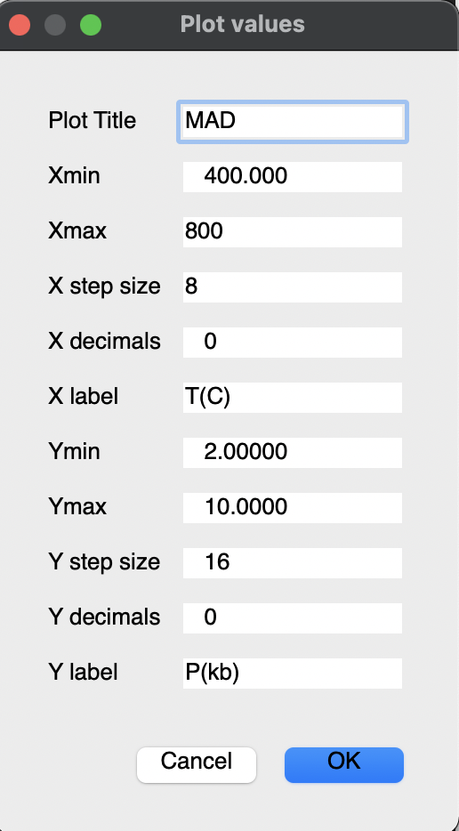

## MadPlotter3 Tutorial

For the `MAD1atutorial.All` file

**by: Frank S. Spear**

### Introduction

This program is designed to plot the results of MAD calculations from the files created by Gibbs3 with the extension `.ALL`. For example `Tutorial_1.All`.

If you ran the MAD tutorial, you should have a set of four “.ALL” files in your folder:

*	`MAD1a tutorial.All`
*	`MAD1b tutorial.All`
*	`MAD1c tutorial.All`
*	`MAD1d tutorial.All`

You will also have `.log` files and a file with no extension. These files can be deleted.

First, we will examine the contents of the `.All` file with a text editor. These are large files (40 + MB) so you need a good text editor. On a Macintosh, BBEdit or Atom work well. You can get BBEdit from [BareBones Software](http://www.barebones.com/) and Atom from [Atom.io](https://atom.io/).

**Open the file `MAD1a tutorial.All` with a text editor.**

The file lists the bulk composition used (in mass and moles), the input file, and the T and P increments. For each T and P on the grid it lists:

*	**Phase name**: every phase in the MIF
* 	**GDiff**: the difference in joules between the tangent plane and the G of this phase. Values of 0 are for phases that sit on the tangent. The positive values are for phases that sit above the tangent. If we had chosen to do an affinity calculation (see tutorial on affinity calculations), the value of phases below the tangent would be negative.
Units are Joules/mol-cation. If you want to convert these to Joules/mol multiply by the number of cations in the formula. If you want to convert to Joules/mol-oxygen, multiply by the number of cations and divide by the number of oxygens. For example, garnet (Fe3Al2Si3O12) has 8 cations. To calculate Joules/mole multiply by 8. To calculate Joules/mole-oxygen, multiply by 8/12.
*	**Millimoles of the phase** (mMoles): Only phases that are stable have non-zero values
*	**Volume of the phase** (units are Joules/bar)
*	**Phase composition**: mole fraction of every phase component in the phase. Note
that phases that are not stable also have compositions shown. These are the compositions that are calculated from the parallel tangent method.

### Plotting Your MAD 

On startup, MadPlotter3 will display the following 

	  0 = Stop
	  1 = Draw plot axes for MAD diagrams (options 3, 4 or 5 -- not for other options)
	 ----Open ".ALL" file -------------------
	  2 = Open file with assemblage data (MAD ".ALL" file)
	 ----Things to plot -------------------
	  3 = Plot all assemblages
	  4 = Pick assemblage to plot
	  5 = Plot a phase occurrence
	  6 = Contour the plot with moles, modes, affinity, or activity of a phase
	  7 = Contour the plot with phase composition or ratios
	  8 = Contour Grt-Biot Kd
	  81 = Contour Gar-Plag-Ms-Bt Keq
	  82 = Contour Gar-Plag-AlSi Keq
	  9 = Contour the entire plot with 0 moles of each phase (draw lines)
	  10 = Make JBB mode output file
	  11 = Test color circle
	  13 = Switch for automatic coloring of assemblages (Default = off)
	  14 = Plot D (Num/Den) between 2 phases
	 -----Path Plotter routines--------------------------
	  15 = Draw Plot axes
	  16 = Plot moles, composition, or affinity of a phase along the path
	 -----Plot X-Y composition diagrams--------------------------
	  30 = Plot mineral compositions on X-Y plot
	  31 = Plot isobaric data (moles, volume, modes, compositions)
	  32 = Plot along a PT path .ALL file (moles, volume, modes, compositions)
	 -----MISC--------------------------
	  20 = Save last graphics file in Illustrator format (you can save any plot as a png file from the menu bar)
	  21 = Parse ".ALL" file into columns for spreadsheet - in mole fractions of components
	  22 = Parse ".ALL" file into columns for spreadsheet - in weight percent
	  23 = Plot Al2SiO5 triple point
	  24 = Plot KFMASH grid on most recent PT plot (SPaC 2000 version)

**Choose:** `2 = Open file with assemblage data (MAD ".All" file)`

Select the file you want to plot -- in this case, `MAD1a tutorial.All`. 

**Chose:** `1 = Draw plot axes for MAD diagrams (options 3, 4, or 5 -- not for other options)` 

Check to see that the values are appropriate for your `.ALL` file. We created MADs from 400-800  ̊C and 2- 10 kb so the defaults should be fine for now.
Also check to see that the “X step size” and “Y step size” are appropriate. The temperature range is 400 degrees so 16 steps will result in tic marks every 25 degrees. The pressure range is 8 kb so 16 steps will result in tic marks every 0.5 kb.
A note on plotting pressure on a P-T diagram. All of the programs use bars as input for pressure EXCEPT for plotting, where the units are kilobars.

Once you have the correct values, click OK. A Plotting canvas with axes will appear behind the main window. Move it to another screen if you have to see it in action. 

**Choose:** `3 = Plot all assemblages`

MadPlotter will not plot all of the assemblages on the canvas that you just made. 

### Saving the MAD 
You can save the plot in two ways: 

1. **Choose:** `20 = Save last graphics file in Illustrator format` to save the file as an Adobe Illustrator file. This option only saves the most recent plot created. Illustrator files are useful because you can click on a color region and the appropriate color in the legend will also be selected. 
2. Save the plot as a .png image from the menu options in the graphic window.   
